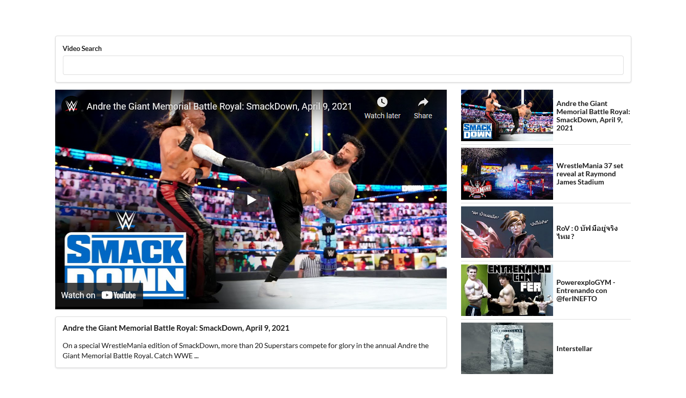

<p align="center">
  <a href="https://github.com/lsprr/video">
    
  </a>
  <h1 align="center">Vdie Player</h1>
</p>

## Table of Contents

* [About The Project](#about-the-project)
  * [Built With](#built-with)
* [Demo](#demo)
* [Getting Started](#getting-started)
  * [Installation](#installation)
* [License](#license)

## About The Project
📺 Watch something on a web video player


### Built With
* React
* React Hooks
* YouTube API
* Semantic UI
* CSS Griid

### Demo


## Getting Started

### Installation

1. Clone the repo

2. Install Yarn packages
```sh
yarn install
```
3. Runs the app in the development mode.
```sh
yarn start
```
4. Don't forget to replace YOUR_SECRET_KEY with your YouTube API key in youtube.js

5. Open [http://localhost:3000/](http://localhost:3000/) to view it in the browser.
## License
This project is open source and available under the [MIT License](LICENSE).
